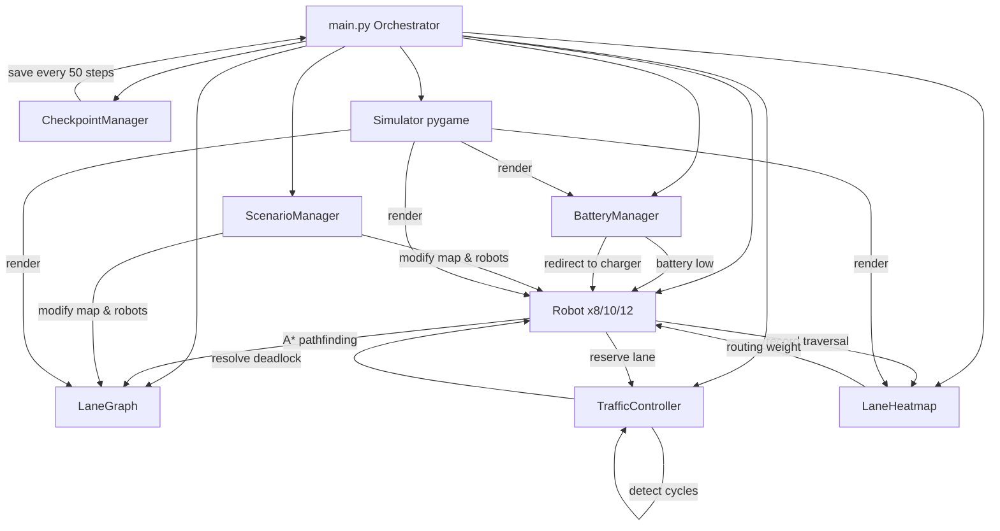

# Architecture

**Last Updated:** April 19, 2026

## System Overview

The system is built as 6 independent modules that communicate 
through shared state.

## Module Structure

```
multi_robot_traffic_control/
├── main.py                      # Orchestrator & entry point
├── src/
│   ├── map/
│   │   └── lane_graph.py        # Graph-based warehouse map
│   ├── robots/
│   │   └── robot.py             # Robot agents with A* pathfinding
│   ├── controller/
│   │   └── traffic_controller.py # Lane reservations & deadlock handling
│   ├── heatmap/
│   │   └── heatmap.py           # Lane usage tracking & congestion
│   ├── battery/
│   │   └── battery_manager.py   # Battery drain, charging, auto-reroute
│   ├── checkpoint/
│   │   └── checkpoint_manager.py # Save/resume simulation state
│   ├── scenarios/
│   │   └── scenario_manager.py  # Night Shift, Peak Hours, Emergency
│   └── visualization/
│       └── simulator.py         # Pygame 60fps real-time display
```

## Data Flow



## Key Design Decisions

### 1. Graph-Based Map
- NetworkX DiGraph with 20 nodes, 50 directed edges
- Each edge stores: max_speed, safety_level, lane_type, 
  congestion_score, historical_usage_count, capacity

### 2. A* Pathfinding with Dynamic Weights
- Base weight from lane metadata
- Congestion penalty: weight × (1 + congestion × 2)
- Closed lanes weight: 99999 (effectively blocked)
- Robots replan when stuck >15 steps

### 3. Two-Phase Deadlock Resolution
- Phase 1: Build wait-for graph every 5 steps
- Phase 2: DFS cycle detection → pick victim by highest ID
- Resolution: release all cycle reservations + force replan

### 4. Battery System
- Drain rates: MOVING=0.8%/step, WAITING=0.2%, IDLE=0.05%
- NARROW/HUMAN_ZONE lanes: 1.5× drain multiplier
- Critical (<10%): auto-reroute to nearest charger
- Charging stations at nodes 3, 7, 11, 15 (+5%/step)

### 5. Scenario Isolation
- ScenarioManager modifies lane_graph and robot goals
- Night Shift: closes 4 lanes, reduces all speeds 30%
- Peak Hours: pre-congests all lanes, limits intersections
- Emergency: redirects all robots to safe zones 16-19
