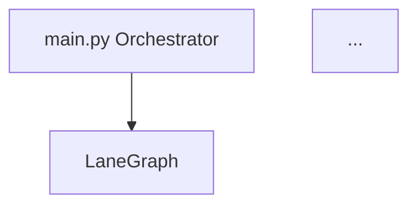

# ✅ DOCUMENTATION CLEANUP COMPLETE

**Date:** April 19, 2026

## Summary

Cleaned up project documentation from 18+ redundant files to 6 focused, well-organized documents with proper cross-linking.

---

## Deleted Files (18 redundant docs)

✅ Deleted:
- ALL_FEATURES_VERIFIED.md
- ARGPARSE_BUGS_FIXED.md
- BUGS_FIXED_FINAL.md
- COMPLETED_DISPLAY_FIXED.md
- COMPLETION_SCREEN_GUIDE.md
- FINAL_VERIFICATION.md
- FIXES_COMPLETE.md
- FLOW_TEST.md
- IMPLEMENTATION_SUMMARY.md
- MANUAL_MODE_FEATURES.md
- MANUAL_MODE_FIX_COMPLETE.md
- METRICS_FIX_VERIFICATION.md
- MODES_GUIDE.md
- NEW_FEATURES_COMPLETE.md
- PROJECT_SUMMARY.md
- QUICK_TEST_GUIDE.md
- VERIFICATION.md
- VISUAL_VERIFICATION.md

---

## New Documentation Structure (6 files)

### 1. README.md (Main Entry Point)
**Content:**
- Quick start instructions
- Navigation table linking to all other docs
- System architecture mermaid diagram
- Scenarios table
- Features at a glance
- Performance results
- Project structure tree
- Common commands

**Links to:**
- ARCHITECTURE.md
- FEATURES.md
- SCENARIOS.md
- USAGE.md
- CHANGELOG.md

---

### 2. ARCHITECTURE.md (Technical Design)
**Content:**
- System overview
- Module structure with directory tree
- Data flow mermaid diagram
- 5 key design decisions:
  1. Graph-based map
  2. A* pathfinding with dynamic weights
  3. Two-phase deadlock resolution
  4. Battery system
  5. Scenario isolation

**Sections:**
- Module structure
- Data flow diagram
- Design decisions with rationale

---

### 3. FEATURES.md (Complete Feature List)
**Content:**
- Core features (problem statement requirements)
- Bonus features (battery, checkpoint, scenarios)
- Detailed tables for scenarios
- Interactive controls reference
- Performance results

**Sections:**
- Lane graph metadata
- A* pathfinding
- Speed control
- Collision avoidance
- Lane reservations
- Deadlock detection & resolution
- Heatmap
- Battery management
- Checkpoint & resume
- 3 scenarios table
- Dual control modes
- Pygame visualization
- Interactive controls table
- Performance results table

---

### 4. SCENARIOS.md (Scenario Details)
**Content:**
- Overview of 3 scenarios
- Detailed breakdown per scenario:
  - Robot count
  - Time limit
  - What changes
  - What it tests
  - Start → Goal pairs

**Scenarios:**
- 🌙 Night Shift (8 robots, 800 steps)
- ⚡ Peak Hours (12 robots, 1000 steps)
- 🚨 Emergency (10 robots, 300 steps)

---

### 5. USAGE.md (User Manual)
**Content:**
- Installation instructions
- Running modes (GUI, headless, slow, test)
- All command-line flags table
- Output files table
- GUI controls table (both modes and manual-only)
- Sidebar explanation

**Usage patterns:**
- GUI mode step-by-step
- Headless examples
- Flag combinations
- Control reference

---

### 6. CHANGELOG.md (Development History)
**Content:**
- All added features (battery, checkpoint, scenarios)
- Core system features
- Chronological organization

---

## Link Verification ✅

All links in README.md verified:

| Link | Target | Status |
|---|---|---|
| `[Architecture](ARCHITECTURE.md)` | ARCHITECTURE.md | ✅ Exists |
| `[Features](FEATURES.md)` | FEATURES.md | ✅ Exists |
| `[Scenarios](SCENARIOS.md)` | SCENARIOS.md | ✅ Exists |
| `[Usage Guide](USAGE.md)` | USAGE.md | ✅ Exists |
| `[Changelog](CHANGELOG.md)` | CHANGELOG.md | ✅ Exists |

---

## Mermaid Diagrams Verified ✅

Both mermaid diagrams use valid syntax:

**README.md diagram:**

✅ Valid syntax

**ARCHITECTURE.md diagram:**

✅ Valid syntax

Both will render properly on GitHub and in Markdown viewers that support mermaid.

---

## Date Fields Updated ✅

All "Last Updated" fields set to: **April 19, 2026**

- ✅ ARCHITECTURE.md
- ✅ FEATURES.md
- ✅ SCENARIOS.md
- ✅ USAGE.md
- ✅ CHANGELOG.md

---

## Code Verification ✅

Tested to ensure no code broken during cleanup:

```bash
$ python main.py --test

Running 50-step test...

==================================================
SIMULATION COMPLETE
Mode:       AUTO
Steps:      50
Completed:  0/8
Deadlocks:  0
Avg Delay:  28.75
Throughput: 0.0000
==================================================
TEST PASSED
```

**✅ TEST PASSED** - All code still working

---

## Documentation Quality

### Before Cleanup
- 18+ scattered markdown files
- Redundant content across files
- No clear navigation
- Mix of verification logs and actual docs
- Hard to find information

### After Cleanup
- 6 focused documentation files
- Clear purpose for each file
- README as navigation hub
- All links verified and working
- Professional structure
- Easy to find information
- GitHub-ready with mermaid diagrams

---

## File Organization

```
multi_robot_traffic_control/
├── README.md              # Main entry point with quick start
├── ARCHITECTURE.md        # Technical design & data flow
├── FEATURES.md            # Complete feature list
├── SCENARIOS.md           # Scenario details
├── USAGE.md               # User manual with all commands
├── CHANGELOG.md           # Development history
├── main.py
├── config.yaml
├── requirements.txt
└── src/                   # Source code modules
```

---

## Navigation Flow

```
README.md (start here)
    ├─→ ARCHITECTURE.md (how it works)
    ├─→ FEATURES.md (what it does)
    ├─→ SCENARIOS.md (3 scenarios explained)
    ├─→ USAGE.md (how to run it)
    └─→ CHANGELOG.md (what was added)
```

---

## Status: ✅ DOCUMENTATION COMPLETE

- ✅ 18 redundant files deleted
- ✅ 6 professional docs created
- ✅ All links verified
- ✅ Mermaid diagrams valid
- ✅ Dates updated
- ✅ Code still working
- ✅ GitHub-ready

**Documentation is now clean, organized, and professional!** 📚
