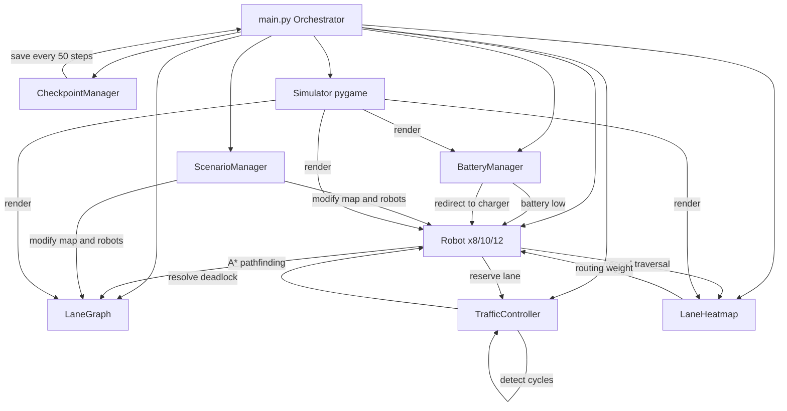

# Multi-Robot Traffic Control System

A lane-aware traffic control simulation for warehouse robots,
built for the GOAT Robotics Hackathon.

8–12 autonomous robots navigate a warehouse using A* pathfinding,
lane reservations, deadlock resolution, and real-time heatmap 
routing — all visualized in a 60 FPS pygame interface.

---

## Quick Start

```bash
pip install -r requirements.txt
python main.py          # GUI with menu
python main.py --test   # Quick 50-step test
```

---

## Navigation

| Document | Description |
|---|---|
| [Architecture](ARCHITECTURE.md) | Module structure, data flow diagram, design decisions |
| [Features](FEATURES.md) | All features with performance results |
| [Scenarios](SCENARIOS.md) | Night Shift, Peak Hours, Emergency details |
| [Usage Guide](USAGE.md) | All commands, flags, controls, output files |
| [Changelog](CHANGELOG.md) | Full development history |

---

## System Architecture



---

## Scenarios

| | Scenario | Robots | Steps | Key Challenge |
|---|---|---|---|---|
| 🌙 | Night Shift | 8 | 800 | Closed lanes, reduced speeds |
| ⚡ | Peak Hours | 12 | 1000 | Max congestion, deadlocks |
| 🚨 | Emergency | 10 | 300 | Countdown, race to safe zones |

---

## Features at a Glance

**Core (Problem Statement)**
- Lane graph with full metadata per edge
- A* pathfinding with dynamic congestion weights
- Speed control by lane type and safety level
- Collision avoidance with safe following distance
- Lane reservations for CRITICAL lanes
- Deadlock detection (wait-for graph + DFS) and resolution
- Real-time lane heatmap with hotspot detection
- Robot trajectories, metrics, and heatmap PNG export

**Bonus**
- Battery management with auto-charging
- Checkpoint & resume
- 3 unique scenarios (8/10/12 robots)
- Manual control mode
- Animated pygame UI (notifications, effects, sidebar)

---

## Performance

| Scenario | Completed | Steps | Deadlocks |
|---|---|---|---|
| Night Shift | 8/8 | ~383 | 0 |
| Peak Hours | 12/12 | ~450 | varies |
| Emergency | 10/10 | ~85 | 0 |

---

## Project Structure

```
multi_robot_traffic_control/
├── main.py
├── config.yaml
├── requirements.txt
├── src/
│   ├── map/lane_graph.py
│   ├── robots/robot.py
│   ├── controller/traffic_controller.py
│   ├── heatmap/heatmap.py
│   ├── battery/battery_manager.py
│   ├── checkpoint/checkpoint_manager.py
│   ├── scenarios/scenario_manager.py
│   └── visualization/simulator.py
├── results_summary.json
├── heatmap.png
├── simulation.log
└── checkpoint.json
```

---

## Commands

```bash
python main.py                                    # GUI
python main.py --test                             # TEST PASSED
python main.py --headless --scenario peak_hours   # headless
python main.py --headless --scenario emergency    # countdown
python main.py --resume --headless                # resume
python main.py --slow                             # slow motion
```

---

*Built with Python 3.13, pygame 2.6, networkx, numpy, matplotlib*
