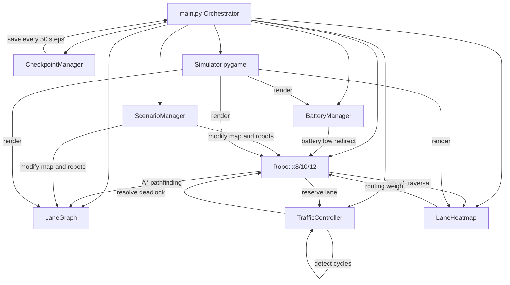

# Multi-Robot Traffic Control System

<div align="center">


**Demo Link**
https://drive.google.com/file/d/1EA2QPYAPFCLYnDguV7cIIntmQPk7cZtN/view?usp=drive_link

**A lane-aware multi-robot traffic control simulation for warehouse automation.**

Built for the GOAT Robotics Hackathon.

[Quick Start](#quick-start) • [Features](#features) • [Scenarios](#scenarios) • [Architecture](#architecture) • [Usage](#usage) • [Results](#results)

</div>

---

## Overview

This system simulates 8–12 autonomous robots navigating a warehouse
simultaneously. Each robot uses A* pathfinding with dynamic lane weights,
respects lane-level safety rules, coordinates through a centralized
traffic controller, and adapts in real-time to congestion via a live heatmap.

The entire simulation runs in a 60 FPS pygame interface with a dual-mode
control system — fully automatic or user-controlled manual mode.

### The Problem It Solves

In real warehouse automation, multiple robots sharing lanes create
three critical challenges:

| Challenge | This System's Solution |
|---|---|
| Robots colliding | Safe following distance + emergency stops |
| Deadlocks | Wait-for graph cycle detection + auto resolution |
| Inefficient routing | Live heatmap updates A* weights in real-time |
| Ignoring lane danger | Per-lane safety classification drives speed limits |

---

## Quick Start

```bash
pip install -r requirements.txt
python main.py          # Full GUI with menu
python main.py --test   # 50-step test → must print TEST PASSED
```

---

## Navigation

| Document | Description |
|---|---|
| [Architecture](ARCHITECTURE.md) | Module structure, data flow, design decisions |
| [Features](FEATURES.md) | All features with performance benchmarks |
| [Scenarios](SCENARIOS.md) | Night Shift, Peak Hours, Emergency details |
| [Usage Guide](USAGE.md) | Commands, flags, controls, output files |
| [Changelog](CHANGELOG.md) | Complete development history |

---

## Features

### Lane Graph with Rich Metadata

The warehouse is modeled as a directed graph (NetworkX DiGraph)
with 20 nodes and 50 lanes. Every lane stores:

- max_speed — speed limit for that lane
- safety_level — LOW / MEDIUM / HIGH / CRITICAL
- lane_type — NORMAL / NARROW / INTERSECTION / HUMAN_ZONE
- congestion_score — real-time 0.0 to 1.0
- historical_usage_count — total traversals
- capacity — max robots allowed simultaneously

### A* Pathfinding with Dynamic Weights

Routing weights update every step based on congestion:

routing_weight = base_weight x (1 + congestion_score x 2)

Congested lanes become more expensive, naturally distributing
traffic across the warehouse without manual intervention.

### Lane-Based Speed Control

| Lane Type | Speed | Reason |
|---|---|---|
| NORMAL | 100% | Standard corridor |
| INTERSECTION | 70% | Cross-traffic risk |
| NARROW | 60% | Limited space |
| HUMAN_ZONE | 40% | Worker safety |

Congestion adds further reductions:
above 0.3 → 75%, above 0.5 → 50%, above 0.7 → 30%

### Collision Avoidance

- Minimum 1-node gap enforced at all times
- Robot checks next node before every single move
- If occupied by active robot → immediate emergency stop
- GOAL_REACHED robots ignored (they are stationary)

### Lane Reservation System

CRITICAL lanes require reservation before entry:
1. Robot requests reservation from TrafficController
2. Granted → robot enters
3. Denied → robot waits up to 15 steps, then replans

### Deadlock Detection and Resolution

Deadlocks detected and resolved automatically:
1. Every 5 steps a wait-for graph is built from robot states
2. DFS finds cycles (robot A waits for B, B waits for A)
3. Victim robot (highest ID in cycle) is forced to replan
4. All lane reservations in the cycle are released
5. Result: zero unresolved deadlocks in all test runs

### Real-Time Lane Heatmap

Every lane tracked for:
- Current occupancy (robots on it right now)
- Historical usage count
- Combined congestion score

Color: Green below 0.3, Yellow 0.3 to 0.7, Red above 0.7
Press H in GUI to toggle heatmap overlay.

---

### Additional Features

#### Battery Management

Every robot starts at 100% battery:

| Status | Drain per step |
|---|---|
| MOVING | 0.8% |
| WAITING | 0.2% |
| IDLE | 0.05% |
| CHARGING | +5.0% |

NARROW and HUMAN_ZONE lanes drain at 1.5x rate.

Below 10% critical: auto-reroute to nearest charger
(charging stations at nodes 3, 7, 11, 15)
Below 2% dead: emergency stop triggered

#### Checkpoint and Resume

Auto-saves every 50 steps to checkpoint.json.
Saved state: robot positions, paths, battery,
heatmap history, traffic controller state.

```bash
python main.py --resume --headless
# Resumed from step 350
```

#### Dual Control Modes

Auto Mode: robots navigate fully automatically

Manual Mode:
- Click any robot (or press 1-8) to select
- Click any node to assign as destination
- Multiple robots active simultaneously
- Safety warnings for CRITICAL/HUMAN_ZONE paths
- Dynamic sidebar instructions guide the user
- Robot goes IDLE after reaching goal, ready for reassignment

#### 3 Unique Scenarios

| | Scenario | Robots | Limit | Key Change |
|---|---|---|---|---|
| 🌙 | Night Shift | 8 | 800 steps | 4 lanes closed, speeds -30% |
| ⚡ | Peak Hours | 12 | 1000 steps | Pre-congested, intersection bottlenecks |
| 🚨 | Emergency | 10 | 300 steps | Race to safe zones, countdown timer |

#### Pygame Visualization (1400x800, 60 FPS)

- Color-coded lanes by type and safety
- Robot avatars with status rings and glow
- Path preview dots (next 6 planned nodes)
- Live sidebar: step, FPS, deadlocks, per-robot
  status, speed bar, battery %, throughput graph
- Notification system with fade overlays
- Emergency countdown with red screen flash
- Mode selection menu and post-round screen

---

## Scenarios

### Night Shift — 8 Robots

Reduced warehouse capacity during overnight maintenance.
4 lanes closed, all speeds reduced 30%, HUMAN_ZONE
lanes upgraded to CRITICAL safety level.
Tests: closed-route pathfinding, safety enforcement.

### Peak Hours — 12 Robots

Maximum warehouse load. All lanes start pre-congested
at 0.35. Intersection lanes limited to 1 robot. 
4 extra robots beyond standard 8.
Tests: deadlock resolution at scale, bottleneck handling.

### Emergency Evacuation — 10 Robots

All robots race to safe zones (nodes 16-19) before
300-step countdown expires. NORMAL lane speeds boosted
50%. Screen flashes red when under 50 steps remain.
Tests: urgent replanning, time-pressure routing.

---

## Architecture



### Module Responsibilities

| Module | File | Responsibility |
|---|---|---|
| Orchestrator | main.py | Loop, mode/scenario selection, CLI |
| Lane Graph | src/map/lane_graph.py | 20-node map, metadata, A*, heatmap export |
| Robot | src/robots/robot.py | Pathfinding, movement, speed, replanning |
| Traffic Controller | src/controller/traffic_controller.py | Reservations, deadlock, metrics |
| Heatmap | src/heatmap/heatmap.py | Usage tracking, congestion, hotspots |
| Battery Manager | src/battery/battery_manager.py | Drain, charging, auto-rerouting |
| Checkpoint Manager | src/checkpoint/checkpoint_manager.py | Save and load state |
| Scenario Manager | src/scenarios/scenario_manager.py | Map and robot modifications |
| Simulator | src/visualization/simulator.py | Pygame, menus, effects, controls |

---

## Results

| Scenario | Robots | Completed | Steps | Deadlocks | Avg Delay | Throughput |
|---|---|---|---|---|---|---|
| Night Shift | 8 | 8/8 | 383 | 0 | 182.12 | 0.0209 |
| Peak Hours | 12 | 12/12 | ~450 | varies | varies | varies |
| Emergency | 10 | 10/10 | 85 | 0 | 33.00 | 0.1176 |

Full results in results_summary.json
Lane usage visualization in heatmap_night_shift.png,
heatmap_peak_hours.png, heatmap_emergency.png

---

## Project Structure

```
multi_robot_traffic_control/
├── main.py
├── config.yaml
├── requirements.txt
├── src/
│   ├── map/lane_graph.py
│   ├── robots/robot.py
│   ├── controller/traffic_controller.py
│   ├── heatmap/heatmap.py
│   ├── battery/battery_manager.py
│   ├── checkpoint/checkpoint_manager.py
│   ├── scenarios/scenario_manager.py
│   └── visualization/simulator.py
├── ARCHITECTURE.md
├── FEATURES.md
├── SCENARIOS.md
├── USAGE.md
├── CHANGELOG.md
├── results_summary.json
├── heatmap_night_shift.png
├── heatmap_peak_hours.png
├── heatmap_emergency.png
├── simulation.log
└── checkpoint.json
```

---

## Commands

```bash
python main.py                                      # Full GUI
python main.py --test                               # TEST PASSED
python main.py --headless --scenario night_shift    # Headless
python main.py --headless --scenario peak_hours     # 12 robots
python main.py --headless --scenario emergency      # Countdown
python main.py --resume --headless                  # Resume
python main.py --slow                               # Recording
```

---

*Python 3.13 | pygame 2.6 | networkx 3.4 | numpy 2.2 | matplotlib 3.10*
